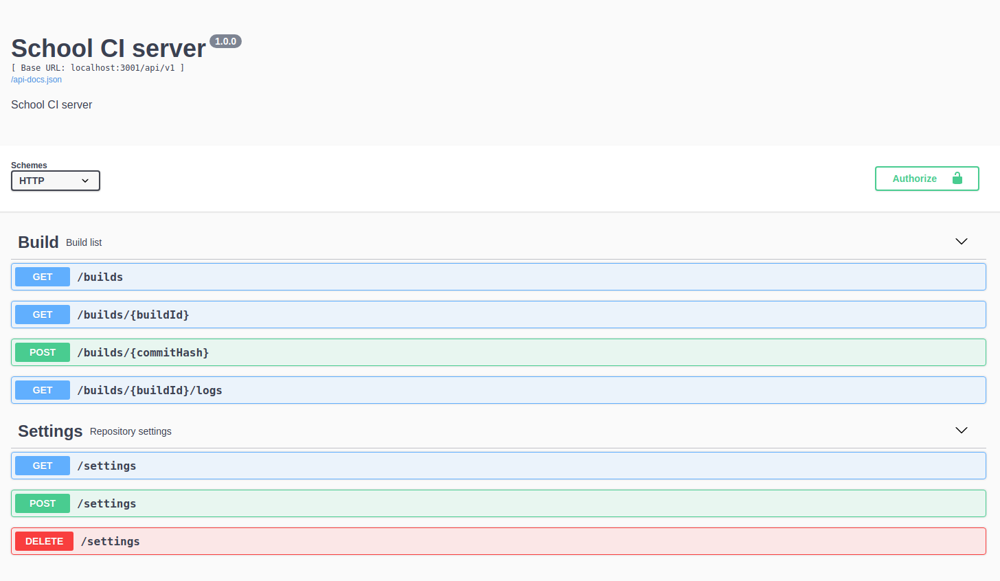
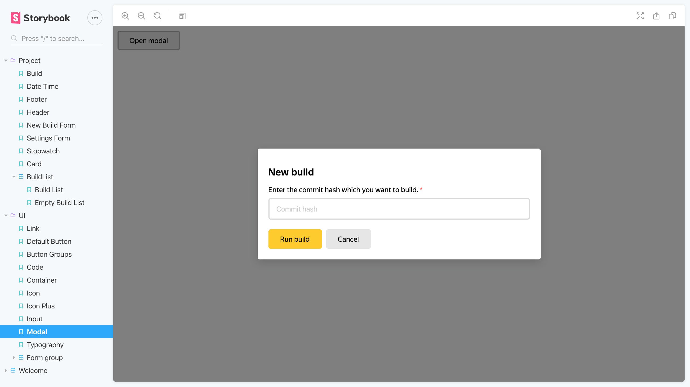
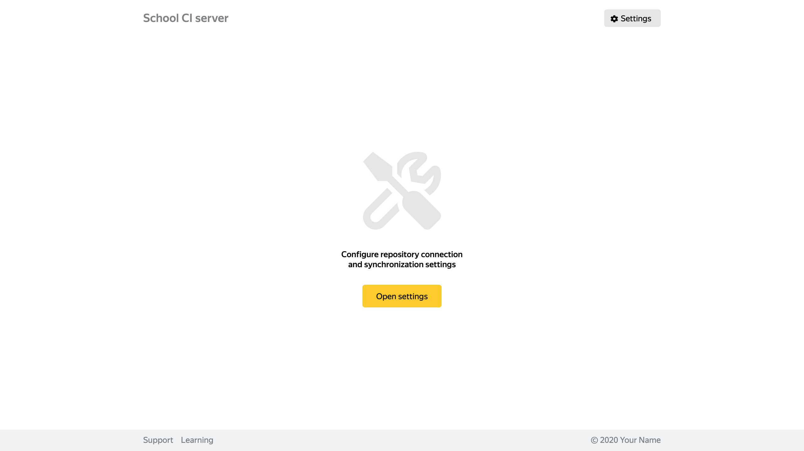

<p align="center">
  <a href="" rel="noopener">
 </a>
</p>

<h3 align="center">Yandex SHRI 2020, CI Node Server</h3>

---

<p align="center"> School CI server (node)</p>

## 📝 Table of Contents

- [About](#about)
- [Getting Started](#getting_started)
- [TODO](#todo)
- [Built Using](built_using)
- [Authors](#authors)

## 🧐 About <a name = "about"></a>




Описание api сделал через swagger http://localhost:8080/api-docs#/

Не все успел реализовать из того, что хотел (см. TODO)

## 🏁 Getting Started <a name = "getting_started"></a>

### Installing

```
git clone git@github.com:MOTORIST/shri-2020-homework-node.git
cd shri-2020-homework-node
yarn install
```
Rename from .env.example to .env and change app settings.
#### Commands
**Note!** Use yarn
```
yarn server:start
yarn server:dev
yarn server:build
yarn client:start
yarn client:build
yarn client:test
```

## ⛏️ Built Using <a name = "built_using"></a>

### workflow
- eslint
- eslint-config-airbnb-base
- prettier
- commitizen
- cz-customizable
- lint-staged

### server
- express
- body-parser
- axios
- express-validation
- dotenv
- cross-env
- winston
- nodemon
  
### api doc
- express-swagger-generator
## ✍️ Authors <a name = "authors"></a>

- [@MOTORIST](https://github.com/MOTORIST)
